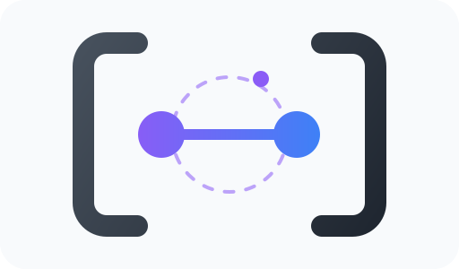
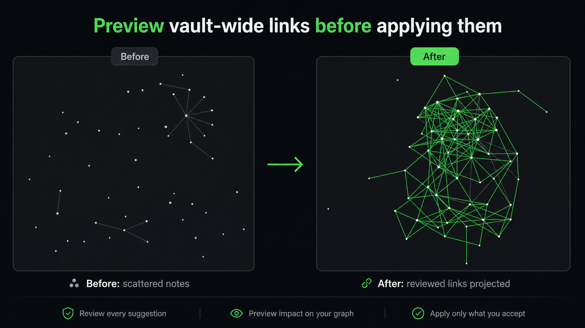
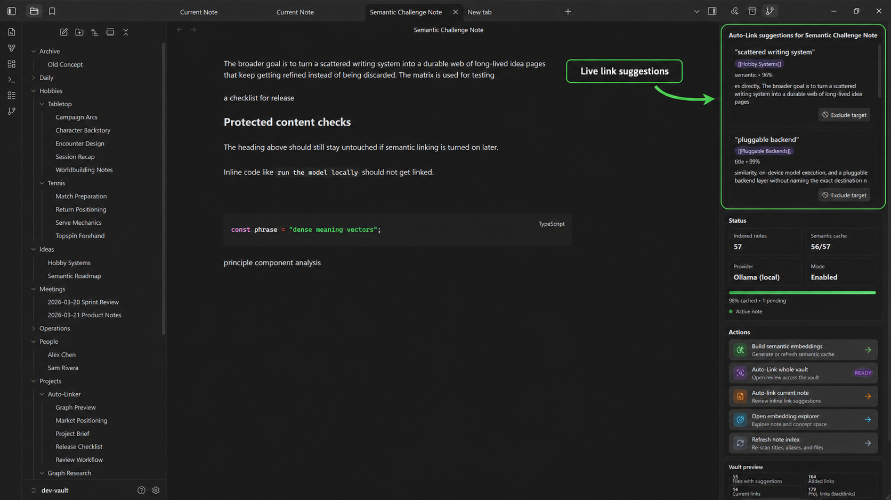
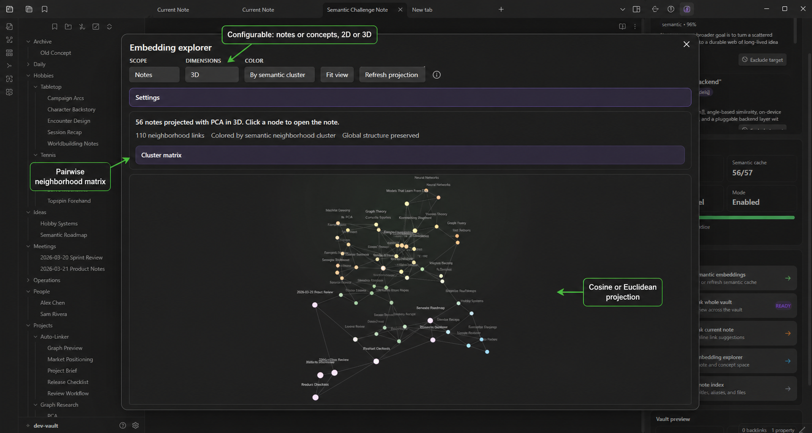

<p align="center">
  
</p>

<h1 align="center">Semantic Auto-Linker</h1>

<p align="center">
  <a href="https://github.com/ysf-ad/semantic-auto-linker/stargazers"></a>
  <a href="https://github.com/ysf-ad/semantic-auto-linker/releases"></a>
</p>

Semantic Auto-Linker is an Obsidian community plugin for safe, reviewable wiki-link insertion with local semantic retrieval.

If Semantic Auto-Linker saves you time, consider starring the repo. Stars help other Obsidian users find the plugin.

It focuses on two things:
- safe inline linking with review before write
- vault-wide review with graph impact and semantic exploration

## Preview links before applying them



Semantic Auto-Linker previews how accepted suggestions reshape your vault graph before anything is written.

## Watch whole-vault review build live


Run a vault-wide scan, choose exact matches, AI matches, or both, and review every suggestion while the graph preview updates. You can close the modal while the scan continues in the background.

## Suggestions while you write



Keep a sidebar open for contextual link suggestions with confidence, source type, context, and one-click target exclusion.

## Explore your semantic note space



The embedding explorer projects your vault into a semantic space, where similar notes appear closer together. Explore notes or extracted concepts, switch between 2D and 3D views, and choose cosine or Euclidean distance for projection.

Click any note to open it, inspect nearby ideas, and use the pairwise neighborhood matrix to understand how concepts and notes relate across your vault.

## Features

- Analyze the current note and review suggested inline `[[links]]`
- Analyze the whole vault and review suggestions before applying
- Choose exact matches, AI matches, or both before each whole-vault scan
- Exclude noisy target notes directly from review rows or settings
- Switch insertion mode per review:
  - `Inline` updates matched text in place
  - `Footer` writes accepted targets into a footer section
- Strong safety rules:
  - skip frontmatter
  - skip fenced code and inline code
  - skip existing wikilinks and Markdown links
  - skip self-links
  - avoid duplicate link targets in the same note
- Deterministic matching for titles, aliases, normalization, and acronyms
- Local semantic retrieval with a built-in embedding model or Ollama
- Embedding explorer with PCA note/concept views
- Persistent whole-vault review state with background refresh when notes change

## Semantic mode

Semantic mode is enabled by default and local-first.

Current provider support:
- Built-in local model through Transformers.js
- Ollama

Typical setup:
1. In Obsidian, open **Settings → Community plugins → Semantic Auto-Linker**.
2. Keep **Semantic provider** set to **Local model (built-in)**.
3. Keep **Local compute** set to **Auto**. It tries graphics acceleration when Obsidian exposes it, then falls back to the processor.
4. Run **Build semantic embeddings**. The default local model downloads automatically on first use and is cached locally.

Optional Ollama setup:
1. Install and run [Ollama](https://ollama.com/).
2. Pull an embedding model, for example:
   - `ollama pull embeddinggemma`
3. Select the Ollama provider and model.
4. Run **Build semantic embeddings**.

## Privacy and network behavior

- The plugin is local/offline by default for deterministic linking.
- The default built-in local model downloads model files from Hugging Face on first use, then runs on-device.
- When semantic mode uses Ollama, the plugin sends note-derived text to the configured Ollama endpoint, which is typically `http://127.0.0.1:11434`.
- Auto-maintenance can rebuild the note index and semantic cache after vault changes if you enable it in settings.
- No telemetry or analytics are included.
- No cloud service is required.

## Commands

- `Open control panel`
- `Analyze current note for safe links`
- `Auto-link current selection`
- `Analyze whole vault for safe links`
- `Show embedding explorer`
- `Build or rebuild semantic index`
- `Build or rebuild note index`
- `Show related notes`

## Development

Install dependencies:

```bash
npm install
```

Build:

```bash
npm run build
```

Lint:

```bash
npm run lint
```

Semantic regression tests:

```bash
npm run test:semantic
```

Dev vault sync:

```bash
npm run build:dev-vault
```

## Manual install

Copy these files into:

```text
<Vault>/.obsidian/plugins/semantic-auto-linker/
```

Files:
- `main.js`
- `manifest.json`
- `styles.css`

Then reload Obsidian and enable the plugin in **Settings → Community plugins**.

## Known limitations

- Semantic suggestions are still more conservative and less reliable than deterministic title/alias matches.
- Semantic quality depends heavily on the local embedding model.
- The plugin is currently desktop-only.

## Release

Marketplace release assets:
- `main.js`
- `manifest.json`
- `styles.css`

`manifest.json` and `versions.json` must be updated together for each release version.
